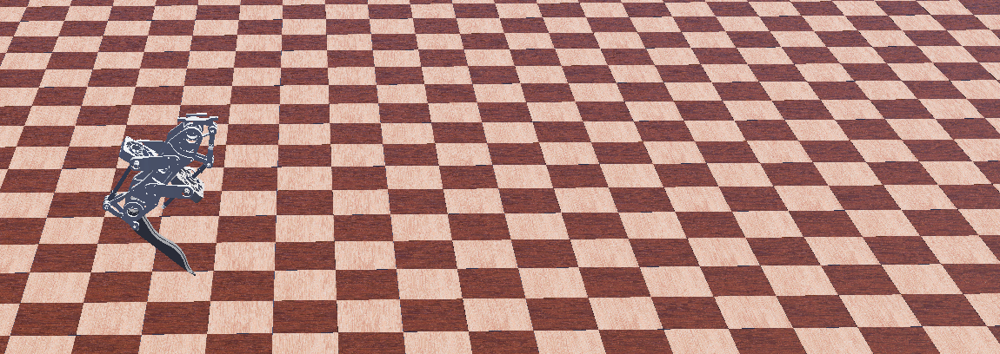

# Cury Leg Webots Simulation

## Introduction

This is the repo for simulation environment based on [Webots](https://github.com/cyberbotics/webots) for Cury, a leg prototype for bipedal robots. Cury can only jump vertically in this environment due to the transparency test bench. This is also one of the supported repo for paper” ” submitted to IROS2024. Feel free to reach out if you have any problems!

## worlds

This folder holds world file as well as related meshes and you can open it through Webots. No need to load Cury through protos files we provided since we have already loaded it.

## controllers

This folder holds the controller for the robot in world file. A simple jumping demo is contained in this controller.

##protos

This folder holds the proto files, the format supported by Webots of Cury.  [protos](https://cyberbotics.com/doc/reference/proto) files used in Webots is transferred by [urdf2webots](https://github.com/cyberbotics/urdf2webots).

## urdf

This folder holds the urdf file. URDF is exported from SolidWorks using [sw_urdf_export](https://wiki.ros.org/sw_urdf_exporter).  

## Tips and trouble shooting

1. Extra sensors are added in the environment. In reality, two encoders are all you need for jumping control.
2. Cury contains two closed-loop chains. To get the right model, proto file is manually modified to add [SolidReference](https://cyberbotics.com/doc/reference/solidreference) and Webots can take care of the constraints. This is the simplest pipeline as far as we know.
3. Useful methods to solve port related bugs:https://stackoverflow.com/questions/48478869/cannot-bind-to-some-ports-due-to-permission-denied

 

